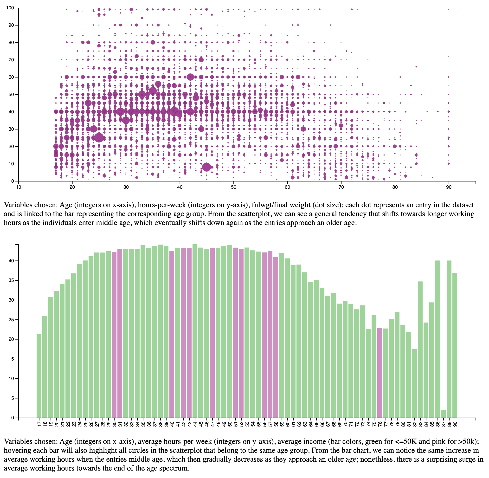

# D3 Linked Graphs

This repository contains a html file (with Javascript embedded) that contains two simple visualizations using the D3 library (V4) based on the Income Evaluation Dataset. Each of the visualizations visually encodes three variables (i.e., columns of the data table) in the dataset.

The two visualizations are interactively linked together. When a user is hovering over an element in one visualization (e.g., a dot in a scatterplot), the corresponding visual element in the other visualization (e.g., a bar in a bar chart) is highlighted (e.g., with a change of color or dot size), and vice versa. The graphs are rendered at real-time by reading the csv file containing the dataset and making needed calculations.

## Explanation

The first visualization is a scatterplot that encodes age (integers on x-axis), hours-per-week (integers on y-axis), and fnlwgt/final weight (represented with the size of each circle). Each dot represents an entry in the dataset and is linked to a rectangle in the bar chart representing the corresponding age group. The second visualization is a bar chart that encodes age (integers on x-axis), average hours-per-week (integers on y-axis), and average income (colors of the rectangles, with green representing average income <=50K and pink for >50K). When the user hovers over an element, the circle(s) will be highlighted with a change in color and radius, and the bar will be highlighted with a change in color. The average working hours per week is obtained from scanning all values within the same age group and calculating the mean. The average income is obtained from detecting the most frequently appeared value (<=50K/>50K) within the same age group.

## Difficulties

The most challenging aspect of this exercise comes from the API differences between each version of D3. Looking up tutorials and resources is therefore difficult, as the functions that work in one tutorial may be renamed or non-existent in the version I selected for my implementation. Therefore, there was an additional process of "translating" the syntax from one version to another. Furthermore, there is also a small learning curve from my lack of experience in JavaScript.

## Main Resources

[Bar Chart Example](https://bl.ocks.org/anonymous/bc5a9691a3417b403d4e8ade3297afa3/3a2434c1c2849e476791e581754ec27e055db4d6)

[Linked Plots Example](http://bl.ocks.org/kbroman/ded6a0784706a109c3a5)

[Scatter Plot Example](https://d3-graph-gallery.com/graph/scatter_basic.html)

## Visualization

Link to the demonstration: https://yyou22.github.io/D3-Linked-Graph/

    

